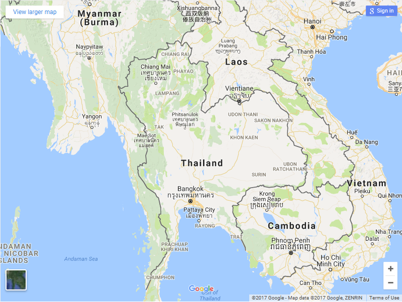
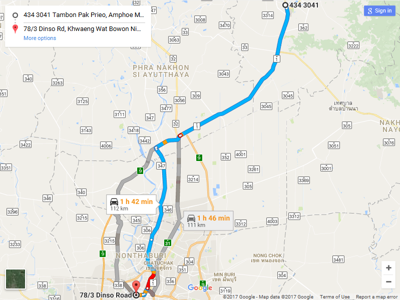

[Home](./README.md)  
[**TFEC** Tech](./tech_stuff.md)

***

# Google Map API
It is a google service to use google map in your own program.  
There are various of Google Map API but this project only use [Direction API] and [Embed API].  
As most of this API require API key, you can create one for yourself [HERE](https://console.developers.google.com/)

***

## Google Map Direction API

From *[Direction API]* :
> The Google Maps Directions API is a service that calculates directions between locations. You can search for directions for several modes of transportation, including transit, driving, walking, or cycling.

Simply access through and HTTP interface with requests constructed as URL.
>  https://maps.googleapis.com/maps/api/directions/json?origin=`Origin`and&destination=`Destination`&key=`YOUR_API_KEY`

Use this to download JSON file and deserialize it to get the information you want.

*Note: You actually can use this API without API key but it still require for some information such as `duration in traffic`*

***

## Google Maps Embed API

From *[Embed API]* :
> The Google Maps Embed API lets you place an interactive map, or Street View panorama on your site with a simple HTTP request. It can be easily embedded in your web page or blog by setting the Google Maps Embed API URL as the src attribute of an iframe.

As the name implies, It is a interactive google map. There is many Map modes to show this interactive map but in this project will use only 2 modes **View Mode** and **Direction Mode**.  
Implements this code in HTML and open it to show interactive google map.

### View Mode
```
<iframe width="600" height="450" frameborder="0" style="border:0"
src="https://www.google.com/maps/embed/v1/view?zoom=6&center=15.8700,100.9925
&key=YOUR_API_KEY" allowfullscreen></iframe>
```
To show view of Thailand as (15.870,100.9925) is coordinate of Thailand.


### Direction Mode
```
<iframe width="600" height="450" frameborder="0" style="border:0"
src="https://www.google.com/maps/embed/v1/directions?origin=Saraburi&destination=Bangkok
&key=YOUR_API_KEY" allowfullscreen></iframe>
```
To show direction with `Saraburi` as origin and `Bangkok` as destination


[Direction API]: https://developers.google.com/maps/documentation/directions/
[Embed API]: https://developers.google.com/maps/documentation/embed/guide?hl=th
