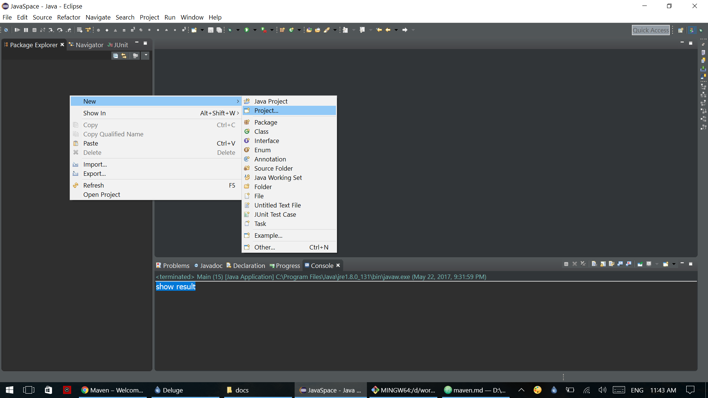
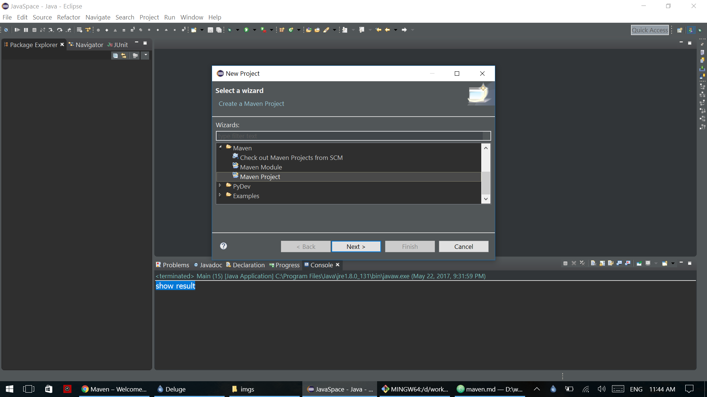
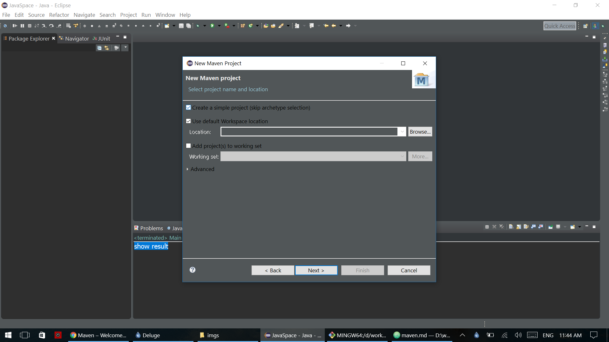
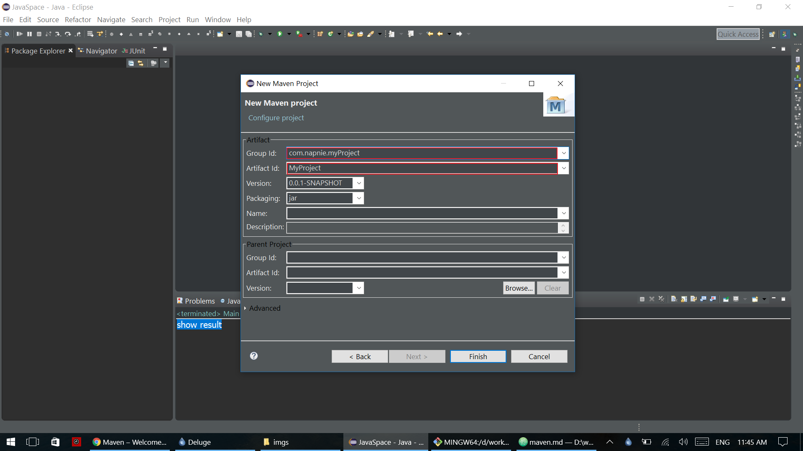
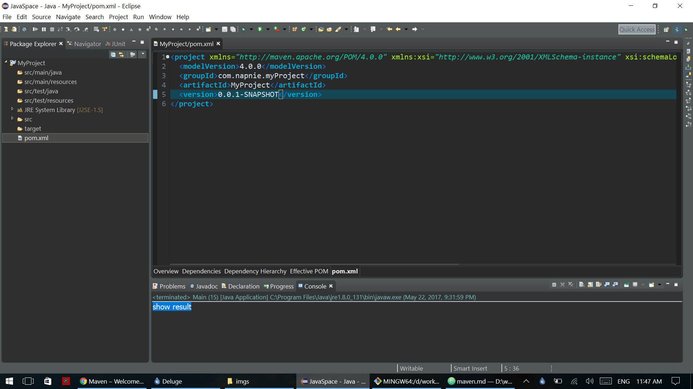
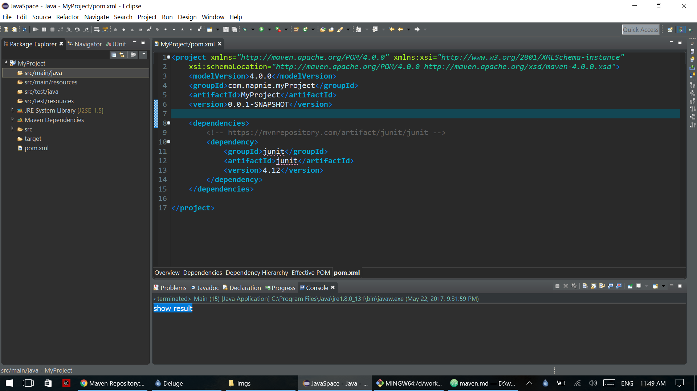

[Home](./README.md)  
[**TFEC** Tech](./tech_stuff.md)

***

# Maven

From [*Apache Maven*](https://maven.apache.org/) :
> Apache Maven is a software project management and comprehension tool. Based on the concept of a project object model (POM), Maven can manage a project's build, reporting and documentation from a central piece of information.

***
## How to create maven project in Eclipse

1. Go to `New > Project`


1. Choose `Maven Project`


1. In this menu, We going to create simple maven project so choose `Choose a Simple project (skip archetype selection)`


1. Fill in `Group Id` and `Artifact Id`. We can leave other blank as a default value.


1. Now we have maven project.  

And we can add dependencies so that we can have other library.  
For example we will add JUnit dependency code.

```
<!-- https://mvnrepository.com/artifact/junit/junit -->
<dependency>
    <groupId>junit</groupId>
    <artifactId>junit</artifactId>
    <version>4.12</version>
</dependency>
```


Now we can use JUnit in our project.
